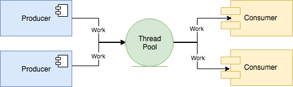

# thread-pool
> A lock-free thread-pool implementation in C++11.

Current version: **1.0.0**

Lead Maintainer: [Halim Qarroum](mailto:hqm.post@gmail.com)

## Description

This project is an implementation of a thread-pool following C++11 semantics. It aims to make it very easy to implement a producer-consumer pattern following C++11 semantics with relatively high performances, although other types of patterns can be implemented on top of this project.

 
 

 

This project uses the lock-free [`concurrent-queue`](https://github.com/cameron314/concurrentqueue/) implementation provided by `moodycamel` as its underlying thread-safe queuing mechanism for task executions to be spread amongst different worker threads.

## Usage
