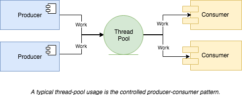

# thread-pool
> A lock-free thread-pool implementation in C++11.

[](https://travis-ci.org/HQarroum/thread-pool)


Current version: **1.0.0**

Lead Maintainer: [Halim Qarroum](mailto:hqm.post@gmail.com)

## Description

This project is an implementation of a thread-pool following C++11 semantics. It aims to make it very easy to implement a [producer-consumer pattern](https://en.wikipedia.org/wiki/Producer%E2%80%93consumer_problem) following C++11 semantics with relatively high performances, although other types of patterns can be implemented on top of this project.

<p align="center"><br>
 
</p><br>

This project uses the lock-free [`concurrent-queue`](https://github.com/cameron314/concurrentqueue/) implementation provided by `moodycamel` as its underlying thread-safe queuing mechanism for task executions to be spread amongst different worker threads.

## Usage

To create a thread-pool instance, you simply call its constructor by providing it with the initial number of threads to provision your thread-pool instance with.

```c++
thread::pool::pool_t pool(std::thread::hardware_concurrency() + 1);
```

> Note that `std::thread::hardware_concurrency` returns the number of physical concurrent threads supported by your system. We add 1, since this API can return 0 if it was not able to compute the amount of concurrent threads.

## Scheduling a callable

The `pool_t` class can schedule the execution of callable objects across your worker threads. The simplest way to do so is to invoke the `schedule` API by providing a callable object, and the arguments to bind to this object. The `schedule` API returns an [`std::future`](https://fr.cppreference.com/w/cpp/thread/future) which you can use to retrieve the result generated by your worker thread (if any) at call-time.

```c++
/**
 * \brief Schedules the execution of a lambda function
 * taking an integer and returning another integer.
 */
auto result = pool.schedule([] (int number) {
 std::cout << "Worker " << std::this_thread::get_id() << " invoked" << std::endl;
 return (number + 1);
}, 42);

// Will block until the result is available.
std::cout << result.get() << std::endl;
```

Note that the `schedule` method can take any callable object as an argument (static functions, lambda functions, pointers to functions, etc.), and will deduce the appropriate return type of the generated `std::future`.

## Scheduling callables in bulk

In order to improve performances, it is advised to schedule the execution of callable objects in bulk, by providing an array of callable objects to schedule rather than a single one. The `schedule_bulk` API is dedicated to bulk insertion of callable objects into the thread-pool.

```c++
/**
 * \brief An array of callable objects to schedule.
 */
static std::function<void()> callables[100];

auto result = pool.schedule_bulk(array_of_callables, sizeof(array_of_callables));
// Log whether the insertion was successful.
std::cout << "The insertion has " << (result ? "succeeded" : "failed") << std::endl;
```

The `schedule_bulk` method only returns a boolean value indicating whether the bulk insertion has been successful or not. For a complete sample of how to schedule callables in bulk into the thread-pool have a look at the [`bulk_insertion`]() example.

## Stopping the thread pool

When you want to interrupt your workers and stop all the threads currently running in your thread-pool, you can use the `stop` method. This method will indicate to the running threads that they should stop their current work.

```c++
// Scheduling the interruption of threads execution,
// and awaiting for them to have completed.
pool.stop().await();
```

