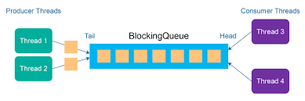

# thread-pool
> A lock-free thread-pool implementation in C++11.

[](https://travis-ci.org/HQarroum/thread-pool)


Current version: **1.0.0**

Lead Maintainer: [Halim Qarroum](mailto:hqm.post@gmail.com)

## Table of contents

- [Description](#description)
- [Usage](#usage)
- [Examples](#examples)
- [Tests](#tests)

## Description

This project is an implementation of a thread-pool following C++11 semantics. It aims to make it very easy to implement a [producer-consumer pattern](https://en.wikipedia.org/wiki/Producer%E2%80%93consumer_problem) following C++11 semantics with relatively high performances, although other types of patterns can be implemented on top of this project.

<p align="center"><br><br>
 
</p><br><br>

The implementation uses the lock-free [`concurrent-queue`](https://github.com/cameron314/concurrentqueue/) implementation provided by `moodycamel` as its underlying thread-safe queuing mechanism for task executions to be spread amongst different worker threads.

## Usage

To create a thread-pool instance, you simply call its constructor by providing it with the initial number of threads to provision your thread-pool instance with.

```c++
thread::pool::pool_t pool(std::thread::hardware_concurrency() + 1);
```

> Note that `std::thread::hardware_concurrency` returns the number of physical concurrent threads supported by your system. We add 1, since this API can return 0 if it was not able to compute the amount of concurrent threads.

## Scheduling a callable

The `pool_t` class can schedule the execution of callable objects across your worker threads. The simplest way to do so is to invoke the `schedule` API by providing a callable object, and the arguments to bind to this object. The `schedule` API returns an [`std::future`](https://fr.cppreference.com/w/cpp/thread/future) which you can use to retrieve the result generated by your worker thread (if any) at call-time.

```c++
/**
 * \brief Schedules the execution of a lambda function
 * taking an integer and returning another integer.
 */
auto result = pool.schedule([] (int number) {
 std::cout << "Worker " << std::this_thread::get_id() << " invoked" << std::endl;
 return (number + 1);
}, 42);

// Will block until the result is available.
std::cout << result.get() << std::endl;
```

Note that the `schedule` method can take any callable object as an argument (static functions, lambda functions, pointers to functions, etc.), and will deduce the appropriate return type of the generated `std::future`.

## Bulk scheduling

In order to improve performances, it is advised to schedule the execution of callable objects in bulk, by providing an array of callable objects to schedule rather than a single one. The `schedule_bulk` API is dedicated to bulk insertion of callable objects into the thread-pool.

```c++
// Scheduling an array of callables in bulk.
auto result = pool.schedule_bulk(array_of_callables, sizeof(array_of_callables));
// Log whether the insertion was successful.
std::cout << "The insertion has " << (result ? "succeeded" : "failed") << std::endl;
```

The `schedule_bulk` method only returns a boolean value indicating whether the bulk insertion has been successful or not. For a complete sample of how to schedule callables in bulk into the thread-pool have a look at the [`bulk_insertion`]() example.

## Functor-style schedules

In addition to the `schedule` method, the thread-pool implementation provides a way to generate functors that can be called like a regular function, but which will instead schedule the execution of your callable on the thread-pool. The functor based syntax provides a more natural way to generate callables and to actually call them.

```c++
// Binding a callable function with a thread-pool instance.
auto callable = thread::pool::bind(pool, static_int_function);
// Scheduling the callable on the thread-pool.
auto result = callable(42);
// Logging the result returned by the callable.
std::cout << result.get() << std::endl;
```

## Pool paramerization

A `thread::pool::parameterized_pool_t<>` class exists in this implementation and allows you to customized the behavior of the thread-pool at compile time. The thread-pool is made such that workers will dequeue callables from the internal queue in bulk in order to improve performances, as such two parameters have been defined to alter the inner workings of the pool :

### Maximum items to dequeue

The number of items that the thread-pool will attempt to dequeue has an impact on performances. To customize this, we have defined a few constants that you can use as hints for thread-pool to use when dequeuing callables.


   - [`WORK_PARTITIONING_LIGHT`](https://github.com/HQarroum/thread-pool/blob/master/thread_pool.hpp#L22) - Hint indicating the use of lightweight processing of tasks within a worker (less elements will be dequeued).

   - [`WORK_PARTITIONING_SPARSE`](https://github.com/HQarroum/thread-pool/blob/master/thread_pool.hpp#L28) - Hint indicating the use of sparse processing of tasks within a worker.
    
   - [`WORK_PARTITIONING_BALANCED`](https://github.com/HQarroum/thread-pool/blob/master/thread_pool.hpp#L34) - Hint indicating the use of a balanced processing of tasks within a worker.
    
   - [`WORK_PARTITIONING_HEAVY`](https://github.com/HQarroum/thread-pool/blob/master/thread_pool.hpp#L40) - Hint indicating the use of heavy processing of tasks within a worker.
    
   - [`WORK_PARTITIONING_HEAVIER`](https://github.com/HQarroum/thread-pool/blob/master/thread_pool.hpp#L46) - Hint indicating the use of heavier processing of tasks within a worker.

You can pass one of these constants as a first template parameter to the `parameterized_pool_t` when creating it (more elements will be dequeued).

```c++
// Configuring the pool for lightweight processing per worker thread.
thread::pool::parameterized_pool_t<thread::pool::WORK_PARTITIONING_LIGHT> pool(
 std::thread::hardware_concurrency() + 1
);
```

> If you wish to have absolute control on this number, rather than using hints, you can safely pass a custom integer instead of one of the provided constants.

## Maximum time to block

Before the internal worker threads actually executes the provided callables, it blocks awaiting for an element in the internal queue to be available. To allow clients of the thread-pool to stop it, a maximum amount of time that the worker thread spends waiting is used, and each time we'll reach that timeout, the worker thread will unblock and check whether it needs to stop its processing.

This parameter can have both an impact on performances and on the reactivity of the pool. If the timeout is too low, a `stop` operation will be quicker, but at the expense of worker threads to consume more CPU cycles unblocking and checking whether they should stop their process. If it is too high, CPU cycles waiste will be lower, but the worker threads will react more slowly to a `stop` operation.

The `parameterized_pool_t` can take a second optional template parameter to set this timeout manually.

```c++
thread::pool::parameterized_pool_t<thread::pool::WORK_PARTITIONING_LIGHT, 2 * 1000> pool(
 std::thread::hardware_concurrency() + 1
);
```

In the above example, worker threads will wait 2 seconds for elements in the queue before unblocking.

## Stopping the thread pool

When you want to interrupt your workers and stop all the threads currently running in your thread-pool, you can use the `stop` method. This method will indicate to the running threads that they should stop their current work.

```c++
// Scheduling the interruption of threads execution,
// and awaiting for them to have completed.
pool.stop().await();
```

## Examples

Different sample usages of the thread-pool can be found in the [examples](examples/) directory.

## Tests


